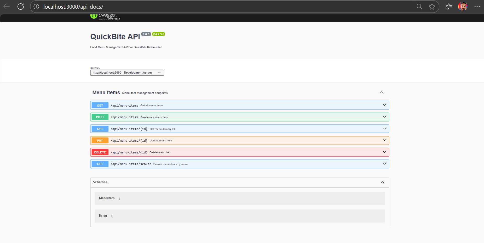
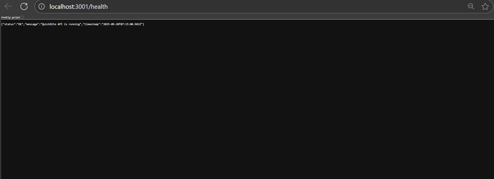
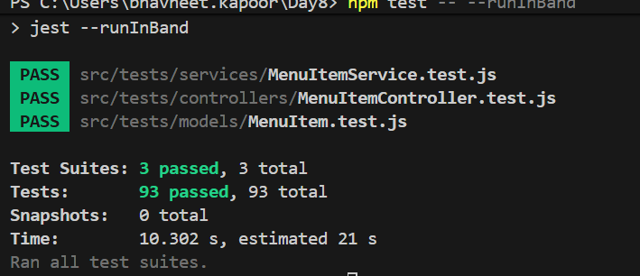

# Swagger ScreenShot


# Test Results

npm test -- --runInBand

> quickbite-api@1.0.0 test
> jest --runInBand

 PASS  src/tests/services/MenuItemService.test.js
 PASS  src/tests/controllers/MenuItemController.test.js
 PASS  src/tests/models/MenuItem.test.js

Test Suites: 3 passed, 3 total
Tests:       93 passed, 93 total
Snapshots:   0 total
Time:        10.302 s, estimated 21 s
Ran all test suites.




## Show one great Copilot prompt
 
 Using TDD approach in our QuickBite API, implement a customer review system for menu items. Follow the existing test-first patterns used in our current test suite (MenuItem.test.js, MenuItemService.test.js, MenuItemController.test.js).

**TDD Requirements - Write Tests First:**

1. **Model Tests** (create tests/models/Review.test.js):
   - Test Review model creation with valid data
   - Test required field validations (menuItemId, customerName, rating)
   - Test rating validation (1-5 range)
   - Test string length validations (customerName 1-100 chars, comment max 500 chars)
   - Test foreign key constraint with MenuItem
   - Test timestamps (createdAt/updatedAt)
   - Follow the exact structure of MenuItem.test.js with beforeAll, beforeEach, afterAll

2. **Service Tests** (create tests/services/ReviewService.test.js):
   - Test createReview() with valid/invalid data
   - Test getReviewsByMenuItemId() returns correct reviews
   - Test getAverageRating() calculates correctly
   - Test deleteReview() removes review and handles not found
   - Test error handling for ValidationError and constraint violations
   - Use same test patterns as MenuItemService.test.js with database cleanup

3. **Controller Tests** (create tests/controllers/ReviewController.test.js):
   - Test POST /api/menu-items/:id/reviews (201 success, 400 validation errors, 404 menu item not found)
   - Test GET /api/menu-items/:id/reviews (200 with data, 404 menu item not found)
   - Test DELETE /api/reviews/:id (200 success, 404 not found)
   - Use supertest like MenuItemController.test.js
   - Test response format matches existing pattern: {success, data/message, error}

**Implementation After Tests Pass:**

4. **Review Model** (src/models/Review.js):
   - Follow MenuItem model structure with Sequelize validations
   - Add association: Review belongsTo MenuItem, MenuItem hasMany Reviews

5. **ReviewService** (src/services/ReviewService.js):
   - Follow MenuItemService patterns with try/catch error handling
   - Same JSDoc comment style
   - Handle ValidationError and UniqueConstraintError like MenuItemService

6. **ReviewController** (src/controllers/ReviewController.js):
   - Follow MenuItemController response patterns
   - Same error response structure
   - Include Swagger documentation following existing @swagger patterns

7. **Routes** (src/routes/reviewRoutes.js):
   - Follow menuItemRoutes.js structure
   - Add to main app.js like existing routes

**Key TDD Principles to Follow:**
- Write failing tests first
- Make tests pass with minimal code
- Refactor while keeping tests green
- Use same test database setup patterns (beforeAll sync, beforeEach cleanup, afterAll close)
- Follow existing assertion patterns and test naming conventions
- Ensure 100% test coverage like current implementation

**Existing Patterns to Maintain:**
- Same validation error messages format
- Same response structure: {success: boolean, data?: any, message?: string, error?: string}
- Same database cleanup patterns in tests
- Same async/await error handling in services
- Same Sequelize model validation structure


## Development Summary

### Copilot-Assisted Development Experience

#### ✅ **What Copilot Helped Achieve Faster**
**Comprehensive Test Suite Generation**: Copilot significantly accelerated the TDD process by generating complete test files with edge cases and error scenarios. When creating the `MenuItemController.test.js`, `MenuItemService.test.js`, and `MenuItem.test.js` files, Copilot automatically suggested comprehensive test cases including:
- CRUD operation tests with success and failure scenarios
- Validation tests for invalid data inputs
- Database constraint testing
- Search functionality tests
- HTTP status code validations

This saved hours of manual test case writing and ensured comprehensive coverage from the start, allowing the project to maintain true TDD principles with failing tests written before implementation.

#### 🔄 **When Copilot Code Required Rejection/Refactoring**
**Data Type Assertions in Tests**: Initially, Copilot generated test expectations that assumed price values would be returned as strings (e.g., `expect(result.price).toBe(menuItemData.price.toString())`), but the actual Sequelize model returned them as numbers. This required refactoring multiple test files to correct the assertions:

```javascript
// Copilot's initial suggestion (rejected):
expect(response.body.data.price).toBe(newMenuItem.price.toString());

// Refactored to match actual behavior:
expect(response.body.data.price).toBe(newMenuItem.price);
```

This taught the importance of understanding the actual data types returned by the ORM rather than blindly accepting AI suggestions, emphasizing the need for developer validation of AI-generated code against real system behavior.

# QuickBite Food Menu Management API

A secure, well-tested RESTful API for restaurant menu management built with Node.js, Express, and SQLite following Test-Driven Development (TDD) principles.

## Features

- **CRUD Operations** for menu items (Create, Read, Update, Delete)
- **SQLite Database** for data persistence
- **Test-Driven Development** with comprehensive test coverage
- **API Documentation** with Swagger/OpenAPI
- **Security Best Practices** with parameterized queries
- **Docker Support** for easy deployment

## Menu Item Schema

Each menu item contains:
- `id` - Unique identifier
- `name` - Item name
- `description` - Item description
- `price` - Item price
- `category` - Food category (appetizer, main, dessert, beverage)
- `dietaryTag` - Dietary information (vegetarian, vegan, gluten-free, etc.)

## Quick Start

### Prerequisites
- Node.js (v16 or higher)
- npm or yarn

### Installation

1. Install dependencies:
```bash
npm install
```

2. Run the application:
```bash
npm run dev
```

3. The API will be available at `http://localhost:3000`

### Testing

Run tests:
```bash
npm test
```

Run tests in watch mode:
```bash
npm run test:watch
```

Generate coverage report:
```bash
npm run test:coverage
```

## API Documentation

Once the server is running, access the Swagger documentation at:
`http://localhost:3000/api-docs`

## API Endpoints

- `GET /api/menu-items` - Get all menu items
- `GET /api/menu-items/:id` - Get menu item by ID
- `POST /api/menu-items` - Create new menu item
- `PUT /api/menu-items/:id` - Update menu item
- `DELETE /api/menu-items/:id` - Delete menu item

## Docker

Build and run with Docker:

```bash
docker build -t quickbite-api .
docker run -p 3000:3000 quickbite-api
```

## Project Structure

```
src/
├── controllers/     # Route controllers
├── models/         # Database models
├── routes/         # API routes
├── services/       # Business logic
├── config/         # Configuration files
├── tests/          # Test files
└── app.js          # Application entry point
```

## Development Guidelines

This project follows Test-Driven Development (TDD):
1. Write failing tests first
2. Implement minimal code to pass tests
3. Refactor while keeping tests green

## Security

- Uses parameterized queries via Sequelize ORM
- Input validation and sanitization
- CORS protection
- Security headers with Helmet.js

